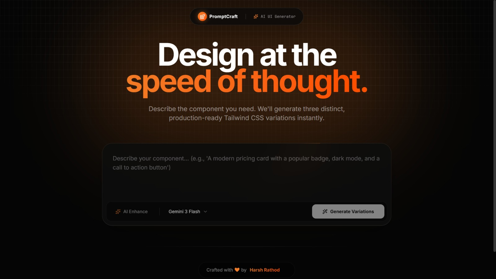

<div align="center">
  

  <br />

  

  <br /><br />

  <p align="center">
    <strong>An absolute powerhouse for building dynamic web components, powered by Google's Gemini Models. Say goodbye to manual boilerplate and hello to infinite UI possibilities.</strong>
  </p>

  <p align="center">
    <a href="#-how-to-use"></a>
    <a href="https://github.com/panduthegang/Prompt-Craft/issues"></a>
    <a href="https://github.com/panduthegang/Prompt-Craft/stargazers"></a>
  </p>
</div>

<hr />

## 📑 Table of Contents
- [About the Project](#-about-the-project)
- [Key Features](#-key-features)
- [Tech Stack & Architecture](#-tech-stack--architecture)
- [Project Structure](#-project-structure)
- [Getting Started](#-getting-started)
- [How to Use](#-how-to-use)
- [Roadmap](#-roadmap)
- [Contributing](#-contributing)
- [License](#-license)
- [Credits](#-credits)

---

## 🚀 About the Project
**Prompt Craft** is explicitly designed to bridge the gap between creative UI/UX ideation and front-end reality. Whether you are an indie hacker rapidly prototyping or a veteran developer who wants to save hours of styling Tailwind classes, this tool serves as your personal intelligent designer. 

Simply describe what you want, enhance your prompt using built-in reasoning algorithms, and let Gemini generate interactive, fully-functional React components instantly.

---

## ✨ Key Features
Prompt Craft goes beyond standard code generation by focusing inherently on the user-experience of development:

- 🧠 **Deep AI Integration:** Hooks directly into Google Gemini (Flash & Pro models), giving you the intelligence of top-tier large language models optimized for code.
- 🎨 **Live Interactive Renderer:** Don't just look at code strings—see the component live! Every output is injected into an isolated, responsive `iframe` environment running React and Tailwind.
- 🪄 **Smart "AI Enhance":** Let our secondary AI layer completely rewrite and formalize your vague prompts into highly explicit instructions that output better results.
- 👻 **Ghost Autocomplete:** Type naturally while the input box intelligently suggests popular component architectures (pricing cards, hero sections, stats dashes, etc.).
- 🔄 **Multi-Variation Generation:** Ask for one component, get many. The model streams back different visual and structural interpretations of your prompt.
- 🕶️ **Premium Glassmorphic UI:** Built with Framer Motion, presenting a dark-node aesthetic that is visually stunning and hyper-responsive.
- 📋 **One-Click Clipboard:** Easily switch between the interactive Preview and the raw Code SyntaxHighlighter, and grab the code with one click.

---

## 🛠️ Tech Stack & Architecture

<p align="center">
  
  
  
  
  
  
</p>

### Why this stack?
- **Vite & React 19:** Phenomenal build speed and the latest component rendering features.
- **Tailwind CSS 4:** Zero-config, infinitely expressive utility classes for lightning-fast styling.
- **Google GenAI SDK:** Reliable, multi-modal prompt streaming directly from the frontend services.

---

## 📂 Project Structure

```text
Prompt-Craft/
├── public/                 # Static assets for the app
│   └── Thumbnail.jpg       # High-quality project thumbnail
├── src/
│   ├── components/         # Modular Presentational and Logic UI
│   │   ├── PromptInput.tsx # Main interface for prompt box and ghost suggestions
│   │   ├── VariationCard.tsx # Code renderer and Live-Preview iframe component
│   │   ├── ResultsSection.tsx # Handles streaming layouts and arrays of outputs
│   │   ├── BackgroundEffects.tsx # The ambient, animated glassmorphic background
│   │   └── ...
│   ├── lib/                # Shared internal constants and helpers
│   │   ├── constants.ts    # Model arrays and ghost-autocomplete dictionaries
│   │   └── utils.ts        # Tailwind `cn` class merger and utility operations
│   ├── services/           # Backend API interaction layer
│   │   └── gemini.ts       # Structured Google Gemini SDK inference logic
│   ├── App.tsx             # Main application layout, header, footer, and state logic
│   ├── index.css           # Global Tailwind utilities and custom scrollbar styles
│   └── main.tsx            # StrictMode React Root entry
├── package.json            # NPM dependencies and script commands
└── vite.config.ts          # Vite localized build and dev-server configuration
```

---

## 🏁 Getting Started

### Prerequisites
Make sure you have [Node.js](https://nodejs.org/) (v18.x or newer) and `npm` installed on your machine.
You will also need an active API Key from [Google AI Studio](https://aistudio.google.com/).

### Installation Steps

1. **Clone the repository:**
   ```bash
   git clone https://github.com/panduthegang/Prompt-Craft.git
   cd Prompt-Craft
   ```

2. **Install all NPM dependencies:**
   ```bash
   npm install
   ```

3. **Configure your environment variables:**
   Create a `.env` file entirely in the root directory and add your Google Gemini API key:
   ```env
   VITE_GEMINI_API_KEY=your_gemini_api_key_here
   ```

4. **Spin up the development server:**
   ```bash
   npm run dev
   ```

5. **Let's Create:**
   Navigate to `http://localhost:5173` in your web browser and start crafting!

---

## 📖 How to Use

1. **Input Generation:** Type a detailed component architectural scheme into the main text box. *(e.g., "A responsive SaaS pricing table with a glowing 'Popular' tier highlighted in orange.")* 
2. **Tab Autocomplete:** Hit `Tab` to automatically fill in our ghost-suggestions to save typing time.
3. **AI Enhance Prompt:** Press **"AI Enhance"** to let the intelligence refactor your prompt to explicitly demand Tailwind tags, responsive behaviors, and standard UI conventions before generating.
4. **Choose Model Base:** Click the dropdown and select between the blisteringly fast *Gemini 3.1 Flash Lite* or the highly complex *Gemini 3.1 Pro* models.
5. **Generate & Preview:** Click **"Generate Variations"**. Instantly watch as the app buffers incoming AI designs. Once rendered, click between "Preview" to toy with the UI interaction, and "Code" to copy the exact raw code!

---

## 🗺️ Roadmap
- [x] Initial React + Vite App architecture setup
- [x] Gemini SDK multi-generation streaming algorithms
- [x] Live Code Execution `iframe` environments
- [x] Ghost prompt autocomplete mechanism 
- [ ] Historical generation storage via LocalStorage/IndexedDB
- [ ] Export specific generated files directly as `.tsx` downloads
- [ ] User-authentication layer for personalized prompt-saves

---

## 🤝 Contributing
Contributions are what make the open-source community such an amazing place to learn, inspire, and create. Any contributions you make are **greatly appreciated**.

1. Fork the Project -> `https://github.com/panduthegang/Prompt-Craft`
2. Create your Feature Branch: `git checkout -b feature/AmazingFeature`
3. Commit your Changes: `git commit -m 'Add some AmazingFeature'`
4. Push to the Branch: `git push origin feature/AmazingFeature`
5. Open a Pull Request!

---

## 📝 License
Distributed under the MIT License. See `LICENSE` for more information.

---

## 👨‍💻 Credits
<br/>

<div align="center">
  
  <h2>Developed and Maintained by <strong>Harsh Rathod</strong></h2>
  <p>If you like this project, please consider giving it a ⭐ on <a href="https://github.com/panduthegang/Prompt-Craft">GitHub</a>!</p>
</div>
